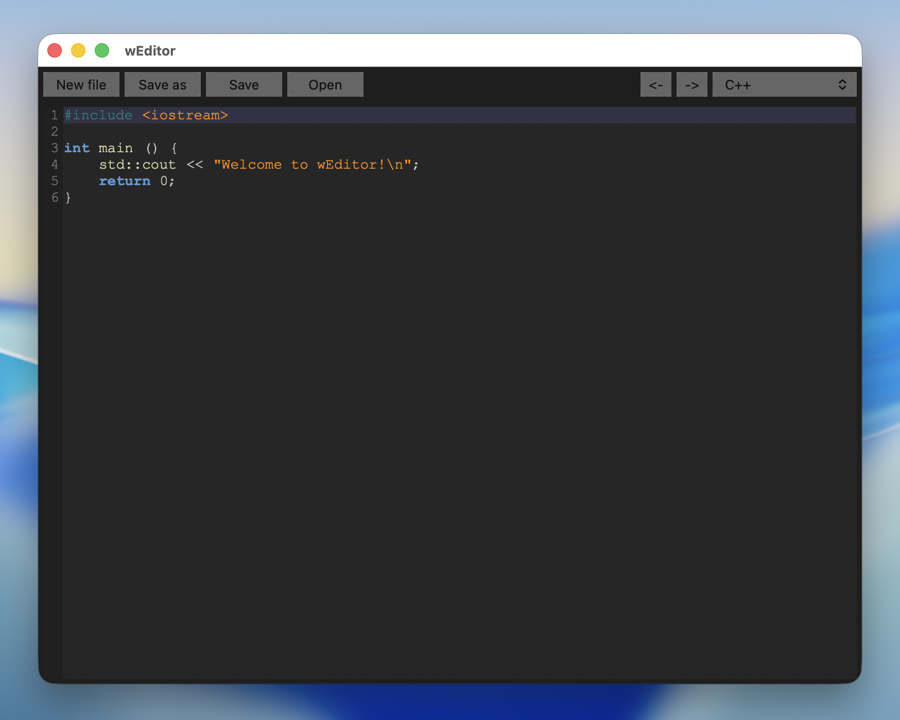

# wEditor


A free and open-source text and code editor written in C++ using the [wxWidgets](https://www.wxwidgets.org/) library. wEditor is a personal hobby project focused on being fast, minimal, and cross-platform.

> **Status:** Beta — the editor is functional but may contain bugs and unfinished features.

---

## Features

- 🎨 **Syntax Highlighting** — readable, colorized code out of the box
- ⚡ **Lightweight & Fast** — minimal footprint, launches instantly
- 🖥️ **Cross-Platform** — runs on Linux, Windows, and macOS
- 📄 **Full File Management** — New, Open, Save, and Save As support
- ↩️ **Undo / Redo** — confidently edit without fear of mistakes
- 💾 **Autosave on Exit** — never lose work accidentally *(can be disabled in Preferences)*
- 🔧 **Preferences Panel** — tweak the editor to your liking
- 📏 **Line Margin** — always know where you are in your file

---

## Downloads

Pre-built binaries are available on the [Releases](https://github.com/TheProjectDark/wEditor/releases) page for:

| Platform | Architecture |
|----------|-------------|
| Linux    | AMD64       |
| Windows 7+ | AMD64    |
| macOS    | ARM64 *(macOS 26+ recommended)* |

---

## Screenshots



---

## Building from Source

### Prerequisites

- **wxWidgets** — It is recommended to build wxWidgets from source. Follow the [official installation guide](https://docs.wxwidgets.org/3.3/plat_osx_install.html) (the guide targets macOS but also works on Linux).
- **Clang** — or another C++ compiler of your choice. If you use a different compiler, update the `Makefile` accordingly.
- **CMake** *(optional)* — a `CMakeLists.txt` is also provided.

### Build Steps

1. Clone the repository:
   ```bash
   git clone https://github.com/TheProjectDark/wEditor.git
   cd wEditor
   ```

2. Build with Make:
   ```bash
   make
   ```

   Or with CMake:
   ```bash
   cmake -B build
   cmake --build build
   ```

3. Run the resulting binary.

---

## Project Structure

```
wEditor/
├── include/weditor/   # Header files
├── src/               # Source files
├── CMakeLists.txt     # CMake build configuration
├── Makefile           # Make build configuration
├── app.ico            # Application icon
└── app.rc             # Windows resource file
```

---

## License

wEditor is licensed under the **GNU General Public License v3.0**. See [LICENSE](LICENSE) for details.

---

## Contributing

Contributions, bug reports, and suggestions are welcome! Feel free to open an [issue](https://github.com/TheProjectDark/wEditor/issues) or submit a pull request.

---

*wEditor is a personal pet-project — thanks for your interest and patience as it continues to evolve!*