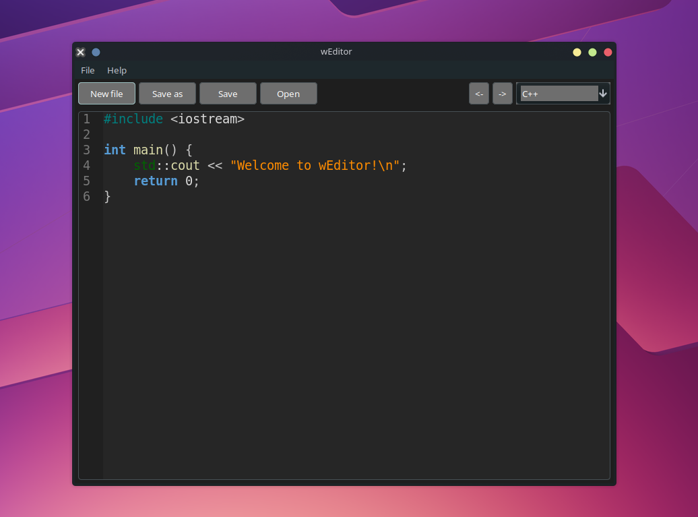
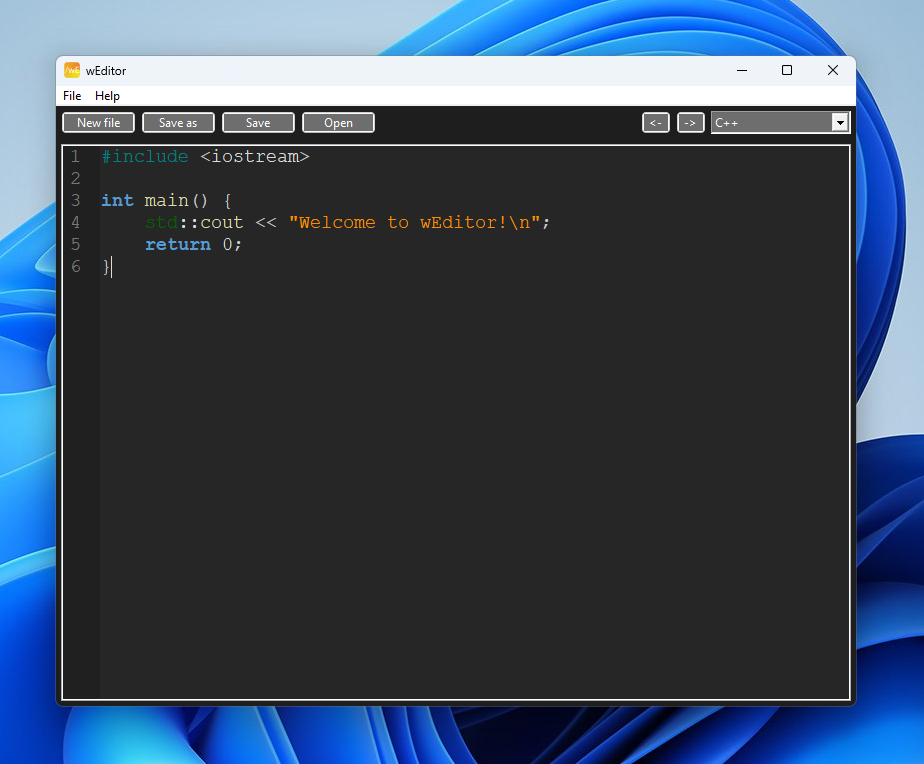
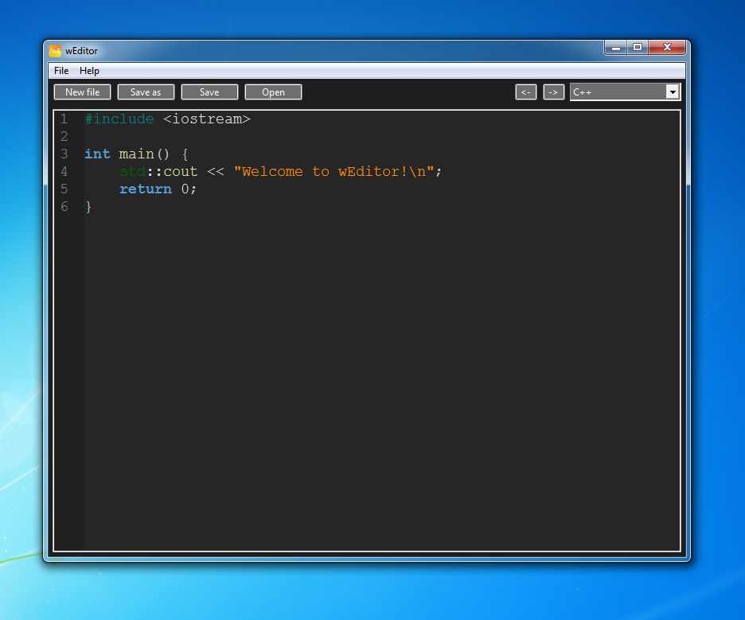

# wEditor


> **⚡ Portable. Lightweight. Cross-Platform.** — wEditor runs on any machine, requires no installation, and stays out of your way.

A free and open-source text and code editor written in C++ using the [wxWidgets](https://www.wxwidgets.org/) library. wEditor is a personal hobby project built around one idea: a fast, no-nonsense editor you can drop on any computer and just use.

> **Status:** Beta — the editor is functional but may contain bugs and unfinished features.

---

## Why wEditor?

Most editors today are bloated with features you never use, slow to start, or tied to a runtime like Electron or Java. wEditor is different — it's a **native C++ application** that launches instantly, uses minimal memory, and runs identically on Linux, Windows, and macOS. No installation required — just grab the binary and go.

---

## Features

- 🎨 **Syntax Highlighting** — readable, colorized code out of the box
- ⚡ **Lightweight & Fast** — tiny footprint, instant startup, no runtime needed
- 🖥️ **Truly Cross-Platform** — one consistent experience on Linux, Windows, and macOS
- 📦 **Portable** — no installation required, just run the binary anywhere
- 📄 **Full File Management** — New, Open, Save, and Save As support
- ↩️ **Undo / Redo** — confidently edit without fear of mistakes
- 💾 **Autosave on Exit** — never lose work accidentally *(can be disabled in Preferences)*
- 🔧 **Preferences Panel** — tweak the editor to your liking
- 📏 **Line Margin** — always know where you are in your file

---

## Downloads

Download pre-built application from the [Releases](https://github.com/TheProjectDark/wEditor/releases) page — no installation needed, just run it.

However, macOS adds all downloaded apps from unknow developers to quarantine, so in order to use the app you need delet quarantine with command ```xattr -d com.apple.quarantine APP PATH```, for example there's the command for Download directroy:
```
xattr -d com.apple.quarantine  ~/Downloads/wEditor.app
```

| Platform   | Architecture |
|------------|-------------|
| Linux      | AMD64       |
| Windows 7+ | AMD64       |
| macOS      | ARM64 *(macOS 26+ recommended)* |

---

## Screenshots






---

## Building from Source

### Linux & macOS — Makefile

**Prerequisites:**
- **Clang for macOS or GCC for Linux** (or another C++ compiler — update the `Makefile` if using a different one)
- **wxWidgets** — build from source using the [official guide](https://docs.wxwidgets.org/3.3/plat_osx_install.html)

**Steps:**
```bash
git clone https://github.com/TheProjectDark/wEditor.git
cd wEditor
make
```

---

### Windows — MSYS2 + CMake

**Prerequisites:**

1. Install [MSYS2](https://www.msys2.org/) and open the **MSYS2 MinGW 64-bit** shell.
2. Install the required packages:
   ```bash
   pacman -S mingw-w64-x86_64-gcc mingw-w64-x86_64-cmake mingw-w64-x86_64-wxwidgets3.2-msw
   ```

**Steps:**
```bash
git clone https://github.com/TheProjectDark/wEditor.git
cd wEditor
cmake -B build -G "MinGW Makefiles"
cmake --build build
```

The compiled binary will be in the `build/` directory.

---

## Project Structure

```
wEditor/
├── include/weditor/   # Header files
├── src/               # Source files
├── assets/            # Pictures for readme
├── CMakeLists.txt     # CMake build configuration (Windows/cross-platform)
├── Makefile           # Make build configuration (Linux/macOS)
├── app.ico            # Application icon
└── app.rc             # Windows resource file
```

---

## License

wEditor is licensed under the **GNU General Public License v3.0**. See [LICENSE](LICENSE) for details.

---

## Contributing

Contributions, bug reports, and suggestions are welcome! Feel free to open an [issue](https://github.com/TheProjectDark/wEditor/issues) or submit a pull request.

---

*wEditor is a personal pet-project — thanks for your interest and patience as it continues to evolve!*